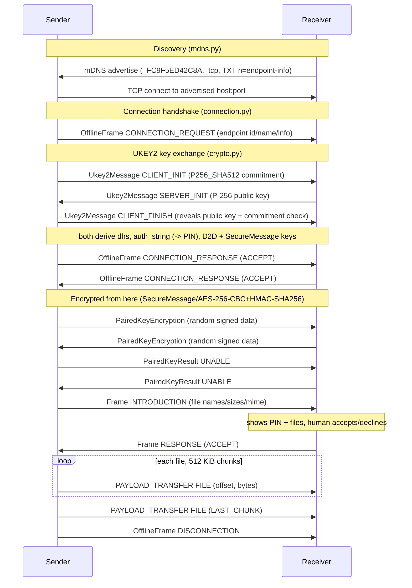

# QuickShare for Linux

Quick Share (formerly Nearby Share) for the Ubuntu/GNOME desktop. QuickShare
speaks Google's wire protocol directly, so it interoperates with:

- **Android** Quick Share
- **Windows** Quick Share
- **macOS** NearDrop
- **itself**, Linux ↔ Linux

No cables, no cloud account, no companion app on the phone — just a shared
WiFi network (or QuickShare's own experimental hotspot, see [Direct
mode](#direct-mode-experimental)) and a 4-digit PIN you confirm on both
screens.

## Contents

- [Working principle](#working-principle)
- [Install](#install)
- [Usage](#usage)
- [Direct mode (experimental)](#direct-mode-experimental)
- [Limitations](#limitations)
- [Security notes](#security-notes)

## Working principle

Everything below lives in `quickshare/core/` — a UI-free library with no
GTK or CLI imports, so the same protocol implementation backs the GUI,
the CLI, and the loopback test (`tests/test_loopback.py`).

### 1. Discovery — mDNS (`quickshare/core/mdns.py`)

QuickShare advertises (and browses for) the DNS-SD service type
`_FC9F5ED42C8A._tcp.local.` — that hex string is Google's Nearby
Connections service ID. Two pieces of the advertisement matter:

- **Instance name**: base64url of 10 bytes — a PCP byte (`0x23`,
  P2P_CLUSTER), the 4-character random endpoint ID, a 3-byte service-ID
  hash, and 2 zero bytes. See `mdns.encode_instance_name`.
- **TXT record `n`**: base64url of the *endpoint info* blob — a flags
  byte (device type in bits 1-3), 16 random bytes, then a
  length-prefixed UTF-8 device name. See
  `connection.build_endpoint_info` / `parse_endpoint_info`.

Android's Quick Share sheet (sending *or* receiving) browses this
service type once it's open on screen. `mdns.Advertiser` and
`mdns.Browser` wrap `zeroconf`'s async API for the advertise and browse
sides respectively.

### 1a. BLE trigger advertising (`quickshare/core/ble.py`)

**Both directions are covered.** Alongside the advertiser, `BleScanner`
passively listens (BlueZ `StartDiscovery`, LE transport, filtered to
UUID `0xFE2C`) for the same beacon coming *from* other devices. When a
nearby phone opens its share sheet or receive screen, QuickShare knows
Quick Share activity is happening around it: the app's device list gets
a live "activity nearby" signal (`ble_activity_nearby` in
`quickshare status --json`), and if you're currently hidden you get a
desktop notification offering to turn visibility on. The beacon itself
carries no address, so the actual device still appears via mDNS —
BLE answers *"is someone around?"*, mDNS answers *"who and where"*.


Real Quick Share doesn't wait for the share sheet to be open on the
*other* device — it wakes it up first with a low-power Bluetooth LE
advertisement, then does the actual discovery/transfer over mDNS+TCP as
above. QuickShare now does the same: while visible, `BleAdvertiser`
broadcasts a static BLE service-data payload on UUID `0xFE2C` (the same
trigger `rquickshare` uses) via BlueZ's `LEAdvertisingManager1` D-Bus
API. The payload carries no identity of its own — it's purely a nudge
that tells a nearby Android phone "something here speaks Quick Share,
go look at mDNS", which is what makes this machine show up in the
phone's Nearby Share sheet proactively instead of only when the phone
happens to be actively browsing.

This requires BlueZ and a Bluetooth adapter with LE advertising
support. When either is missing (no adapter, BlueZ not running, no
permission to the system bus), `BleAdvertiser.start()` raises
`BleUnavailable`, `QuickShareService.ble_status` becomes
`"unavailable: <reason>"`, and QuickShare **falls back to mDNS-only**
automatically — visibility, sending, and receiving all keep working
exactly as before BLE existed, just without the proactive wake-up (see
[Limitations](#limitations)). `quickshare status`'s `ble` field and a
banner in the GUI both surface this state.

### 2. Transport — TCP with length-prefixed frames

Once a peer is chosen, we open a plain TCP connection to its advertised
`host:port`. Every message on the wire, from here until disconnection,
is a protobuf blob wrapped in a 4-byte big-endian length prefix —
`connection.read_frame` / `write_frame`. Nothing below this line is
ever sent unframed.

### 3. Connection handshake — `ConnectionRequest` / `ConnectionResponse`

The initiator sends a plaintext `OfflineFrame` of type
`CONNECTION_REQUEST` carrying its endpoint ID, name, and the same
endpoint-info blob used in mDNS. This is the last plaintext frame that
carries anything peer-identifying before encryption keys exist.

### 4. Key exchange — UKEY2 (`quickshare/core/crypto.py`)

`Ukey2Client` (initiator) and `Ukey2Server` (receiver) run Google's
UKEY2 handshake using the `P256_SHA512` cipher:

1. **CLIENT_INIT** — the initiator generates a P-256 keypair, but sends
   only a *commitment*: `SHA512(CLIENT_FINISH)`, i.e. the hash of a
   message it hasn't sent yet. This is what stops a man-in-the-middle
   from swapping public keys after seeing the response.
2. **SERVER_INIT** — the receiver replies with its own P-256 public key.
3. **CLIENT_FINISH** — the initiator now reveals the message it
   committed to, containing its actual public key. The receiver
   recomputes `SHA512(CLIENT_FINISH)` and checks it against the earlier
   commitment (`Ukey2Server.handle_client_finish`) before trusting it.

Both sides now run ECDH over P-256 and derive everything else via
HKDF-SHA256 (`crypto._derive_session_keys`):

```
dhs         = SHA256(ECDH shared x-coordinate)
auth_string = HKDF(ikm=dhs, salt="UKEY2 v1 auth", info=CLIENT_INIT‖SERVER_INIT)
next_secret = HKDF(ikm=dhs, salt="UKEY2 v1 next", info=CLIENT_INIT‖SERVER_INIT)
client_key  = HKDF(ikm=next_secret, salt=SHA256("D2D"), info="client")
server_key  = HKDF(ikm=next_secret, salt=SHA256("D2D"), info="server")
enc_key(k)  = HKDF(ikm=k, salt=SHA256("SecureMessage"), info="ENC:2")
sig_key(k)  = HKDF(ikm=k, salt=SHA256("SecureMessage"), info="SIG:1")
```

`client_key`/`server_key` become each direction's AES-256-CBC encrypt
key and HMAC-SHA256 sign key (`enc_key`/`sig_key` applied per
direction) — so the initiator's outbound traffic is encrypted with
`client_key`-derived keys and decrypted with `server_key`-derived keys,
and vice versa on the receiver.

`auth_string` is also run through a small polynomial hash
(`crypto.pin_code`, matching Android's exact algorithm) to produce the
**4-digit PIN** shown on both screens. Because it's derived from the
Diffie-Hellman secret itself, matching PINs is proof the ECDH wasn't
intercepted — this is QuickShare's only identity verification (see
[Security notes](#security-notes)).

From here, `crypto.D2DCipher` wraps every frame as a securegcm
`SecureMessage`: an `AES-256-CBC(IV, DeviceToDeviceMessage{seq, frame})`
body plus an `HMAC-SHA256` signature, with a strictly incrementing
per-direction sequence number that `D2DCipher.decrypt` enforces.

### 5. Connection response + paired-key fallback

Both sides exchange plaintext `CONNECTION_RESPONSE` frames (must be
`ACCEPT`), then move to encrypted `OfflineFrame`s. Real Quick Share
supports "paired key" trust — devices that share a Google account skip
PIN confirmation. QuickShare holds no Google account certificates, so
it always sends a `PairedKeyEncryption` frame with random signed data
and then reports `PairedKeyResult.UNABLE` (see
`InboundConnection._handshake` / `OutboundConnection._handshake`) —
exactly what NearDrop does. The peer falls back to PIN-based
verification, which is what QuickShare relies on for every transfer.

### 6. Introduction and transfer

The sender sends an `Introduction` sharing-layer frame listing every
file (name, size, MIME type, a random 64-bit payload ID). The receiver
surfaces this as a `TransferRequest` (device name, PIN, files) via the
`Events.on_transfer_request` callback; a human accepts or declines by
comparing the PIN on both screens. A `Response` frame carries the
verdict back.

On accept, file bytes travel as `PAYLOAD_TRANSFER` frames of type
`FILE`, chunked at 512 KiB (`connection.CHUNK_SIZE`) with an offset and
a `LAST_CHUNK` flag on the final piece — `OutboundConnection._send_file`
/ `InboundConnection._receive_payloads`. Small control messages
(paired-key frames, the introduction/response themselves) use the same
`PAYLOAD_TRANSFER` mechanism but with payload type `BYTES` instead of
`FILE` (`_ConnectionBase._send_sharing_frame` / `_recv_sharing_frame`).
A background task sends `KEEP_ALIVE` frames every 10 s
(`KEEP_ALIVE_INTERVAL`); 30 s without any frame
(`KEEP_ALIVE_TIMEOUT`) is treated as a dead connection. Either side can
end the session cleanly with a `DISCONNECTION` frame.

### Sequence diagram



## Install

Target platform: Ubuntu 24.04 / GNOME.

```bash
# System package for the GTK4/libadwaita GUI bindings (not available via pip).
sudo apt install python3-gi gir1.2-gtk-4.0 gir1.2-adw-1

# Project virtualenv for everything else.
python3 -m venv .venv
.venv/bin/pip install zeroconf protobuf cryptography

# Wire QuickShare into the desktop: PATH symlink, .desktop launchers,
# and the Nautilus right-click "Send with QuickShare" script.
bin/quickshare install
```

`bin/quickshare install` is idempotent (safe to re-run any time, e.g.
after moving the checkout) and prints each step as it goes:

- Symlinks `bin/quickshare` to `~/.local/bin/quickshare` (and warns if
  `~/.local/bin` isn't on your `PATH` — it is by default on Ubuntu for
  login shells).
- Installs `quickshare.desktop` and `quickshare-toggle.desktop` into
  `~/.local/share/applications/`, with `Exec=` rewritten to the
  absolute installed launcher path, then best-effort refreshes the
  desktop database.
- Installs a Nautilus script at `~/.local/share/nautilus/scripts/Send
  with QuickShare` — see [Right-click sharing](#right-click-sharing-nautilus).
  Restart Nautilus (`nautilus -q`) for it to show up.
- Prints (but does not run) the `gsettings` commands to bind
  Super+Shift+S to the visibility toggle — see
  [docs/SHORTCUT.md](docs/SHORTCUT.md) for the full explanation and a
  point-and-click alternative.

Run `bin/quickshare uninstall` to remove everything `install` set up
(same idempotent, step-by-step style).

`bin/quickshare` is a small shell wrapper that resolves this project's
own path and execs `.venv/bin/python -m quickshare.cli` — it works
whether you call it via the full path or the `~/.local/bin` symlink
above, and it's what `quickshare.desktop`'s `Exec=quickshare gui` and
the keyboard shortcut in [docs/SHORTCUT.md](docs/SHORTCUT.md) both rely
on being on `PATH`.

The GUI itself is launched as `python -m quickshare` (the `quickshare`
package's `__main__.py`); `quickshare gui` (and the desktop file) just
exec that for you inside the project's venv.

## Usage

### GUI

```bash
quickshare gui
```

Opens the main window: a visibility switch, the nearby-devices list for
sending, and incoming-transfer prompts (PIN + accept/decline) when
someone sends to you.

### CLI

All CLI subcommands talk to the *running* app over a Unix control
socket, so open the GUI first for anything except `send` (see below,
which can also work standalone):

```bash
quickshare status          # visibility, device name, peer count, BLE state
quickshare on               # become visible
quickshare off               # hide from nearby devices
quickshare toggle            # flip visibility (fires a desktop notification)
quickshare peers             # list currently-discoverable nearby devices
quickshare send photo.jpg report.pdf --to "Pixel 8"
quickshare send photo.jpg    # only one nearby peer? --to is optional
```

Every subcommand accepts `--json` for scripting (raw JSON response
instead of the human-readable summary). `status`'s response includes a
`ble` field (`"on"`, `"off"`, or `"unavailable: <reason>"`) — see
[BLE trigger advertising](#1a-ble-trigger-advertising-quicksharecoreblepy).

`on` and `toggle` are special-cased: if the app isn't running yet, they
launch it for you (`python -m quickshare`, detached) instead of failing
— so a keyboard shortcut bound to `quickshare toggle` always does
something useful. Every other subcommand (`off`, `status`, `peers`)
just prints `QuickShare app is not running` and exits non-zero if
there's no app to talk to.

`send` works even with no app running at all: it starts a temporary,
UI-less instance of the same core library just long enough to browse
for peers (up to 20 s) and send the files directly, printing the PIN as
soon as the handshake produces one so you can confirm it against the
receiving screen.

**Reality check**: to *send* to something (an Android phone, a Windows
PC, another Linux box), it only shows up in `quickshare peers` / the
GUI's device list while *its* Quick Share receive screen or share sheet
is open — sending is one-directional discovery, this machine doesn't
broadcast a BLE wake-up trigger *to* other devices, it only advertises
one for others to notice *this* machine. See
[Limitations](#limitations).

### Right-click sharing (Nautilus)

After `bin/quickshare install` (and a Nautilus restart —
`nautilus -q`), right-click one or more files in the Files app and
choose **Scripts → Send with QuickShare**. This opens a small standalone
picker dialog (`quickshare/ui/picker.py`, launched via
`quickshare send-picker FILE...`) listing nearby devices; click one to
send. It works whether or not the main QuickShare window is already
open — if it is, the picker reuses its live peer list over the control
socket; if not, it briefly browses on its own — and it always shows a
progress bar and the PIN to confirm on the receiving screen, the same
as any other send.

### Keyboard shortcut

See [docs/SHORTCUT.md](docs/SHORTCUT.md) for exact GNOME Settings steps
and a copy-paste `gsettings` one-liner to bind a key (suggested:
Super+Shift+S) to `quickshare toggle` — or just run `bin/quickshare
install`, which prints the same commands (see [Install](#install)).

## Direct mode (experimental)

When there's no WiFi network in common with the other device (hotel,
train), Direct mode has QuickShare stand up its own WiFi hotspot via
`nmcli`, show a QR code (standard `WIFI:` format) for the phone to scan,
and once the phone joins, the normal mDNS + transfer flow above runs on
that subnet. It's labeled experimental because hotspot creation depends
on NetworkManager permissions and AP-capable WiFi hardware, and it
temporarily takes the laptop off its regular network. This piece lives
outside `quickshare/core/` (see the GUI's hotspot integration) and isn't
covered further here.

## Limitations

- **Same-LAN (or Direct mode hotspot) only** — no internet-relayed
  transfers.
- **Receiving (phone → Linux) needs BLE for proactive discovery** —
  while visible, this machine broadcasts a BLE trigger (see
  [BLE trigger advertising](#1a-ble-trigger-advertising-quicksharecoreblepy))
  so an Android phone's share sheet notices it without the phone doing
  anything first. That requires BlueZ and an LE-capable adapter; if
  either is missing, QuickShare falls back to mDNS-only automatically
  (`quickshare status`'s `ble` field, and a banner in the GUI, both flag
  this), and in that fallback case the phone's Quick Share sheet must
  already be open for it to see this machine at all.
- **Sending (Linux → phone) always needs the phone's screen open** —
  this machine has no way to wake up the *other* device; to send
  something to a phone (or any peer), its Quick Share receive screen
  (or share sheet) must already be open so it shows up in
  `quickshare peers` / the device list in the first place.
- **No contact-based visibility** — v1 only implements "Everyone"-style
  visibility; there's no "Contacts only" or "Your devices" mode, and
  the phone will show this machine under its "Everyone" list.
- **No Google account trust** — see [Security notes](#security-notes);
  every transfer needs a manual PIN confirmation, even between two of
  your own machines.

## Security notes

- **End-to-end encryption**: every frame after the UKEY2 handshake is
  AES-256-CBC encrypted and HMAC-SHA256 signed per direction
  (`crypto.D2DCipher`), with keys derived from an ECDH exchange over
  P-256 that neither side could have influenced ahead of time.
- **PIN verification is the trust anchor**: the commitment scheme in
  UKEY2 (§4 above) guarantees that if both screens show the same
  4-digit PIN, the key exchange wasn't tampered with. QuickShare has no
  other identity check — always compare the PIN before accepting a
  transfer from a device you don't recognize.
- **What `PairedKeyResult.UNABLE` means**: Quick Share normally lets
  devices signed into the same Google account skip PIN confirmation
  ("paired key" trust). QuickShare doesn't implement Google account
  certificates at all, so it always reports `UNABLE` to pair that way,
  which forces PIN confirmation on *every single transfer* — there is
  no way to mark a device as permanently trusted. This is a deliberate
  simplification, not a missing feature to be worked around.
